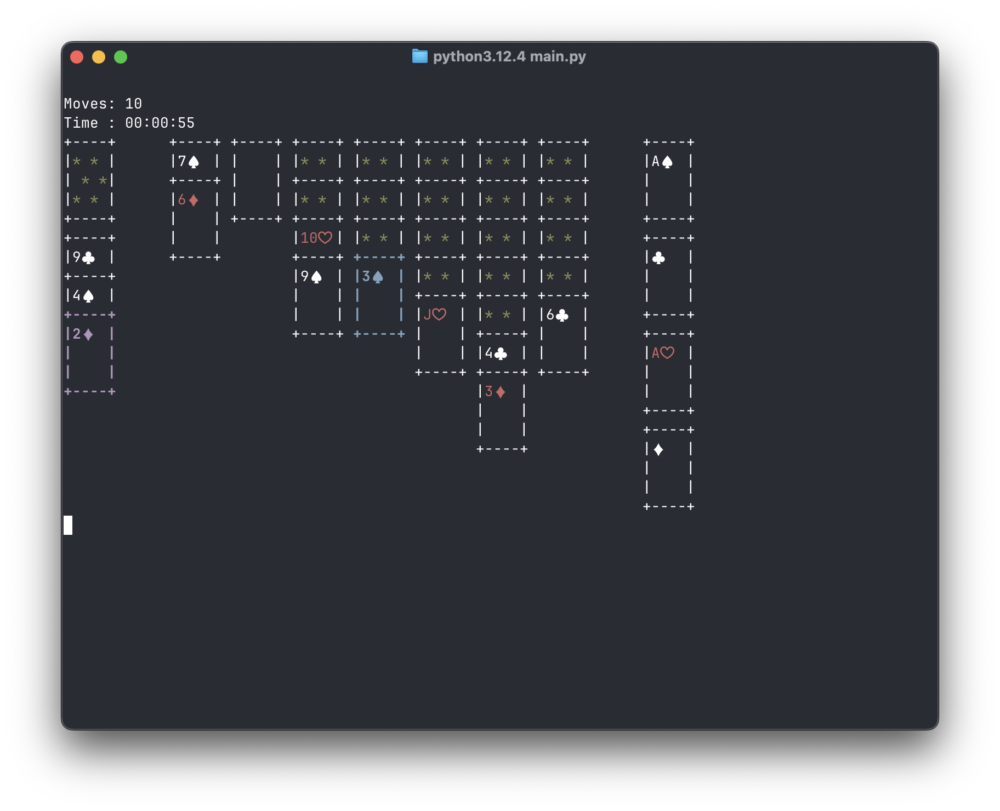

# solitare


Terminal-based solitare game made in Python for the Gigathon 2025 competition.



## Installation

To install the game, run

```bash
git clone https://github.com/kamix-08/solitare.git
cd solitare
```

To download all necessary dependencies, run

```bash
pip install -r requirements.txt
```

To finally execute the program, run

```bash
python main.py
```

> [!NOTE] 
> This requires Python already installed. 
> Recommended version is 3.12.x

The project has [`mypy.ini`](./mypy.ini) configured, allowing you to run

```bash
mypy .
```

## Gameplay

### Controls

The controls are intuitive - use the arrow keys to move (the selection is usually green in the menus and blue in the game scene).

Use Enter to select (will light up in magenta) and Esc to cancel/exit in the game scene.

Use Backspace to undo your last move (up to three moves) and Tab to auto-complete the game, when possible.

### Game

To move a card, first select it, and then select the place you want to move it.

To draw a card from the reserve pile, simply select the pile and press Enter.

In easy mode, you draw one card at a time from the reserve pile. In hard mode, you draw three cards at a time, but only the top one can be used.

Your moves are counted and stored in a local leaderboard.

## Other info

This project also contains a [README in Polish](./README-pl.md) and a [technical documentation](./technical.md) (also in Polish), as requested by the organizers.